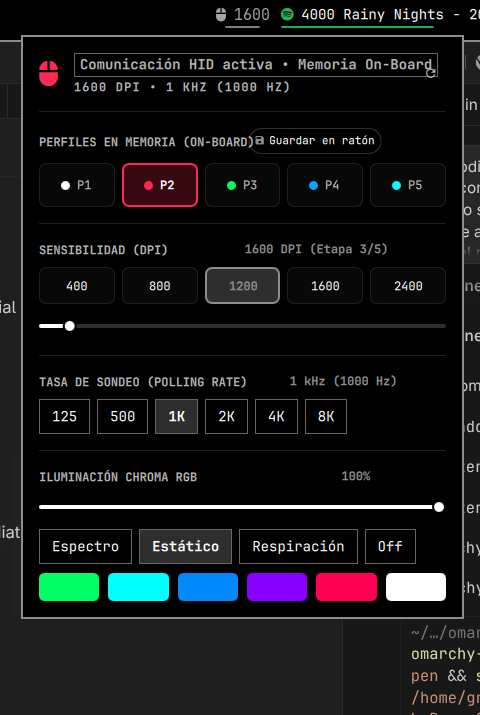

# Oma Razer Control (`oma.razer`)

<div align="center">

[](https://omarchy.org)
[](LICENSE)
[](https://kernel.org)
[](https://razer.com)

**Native Razer Mouse Control for the Omarchy Desktop Shell**

*Full On-Board Memory Profile Switching, 8000 Hz Hyper-Polling, 5-Stage DPI, and Calibrated Chroma RGB Lighting.*

<br/>



</div>

---

## Overview

**Oma Razer Control** brings seamless, lightweight Razer peripheral management directly to your Omarchy status bar. No bloated background daemons, no cloud accounts, and no Electron apps.

Communicate directly with the mouse's internal hardware controller over native Linux `/dev/hidraw` to switch on-board profiles, tune polling rates up to **8000 Hz**, calibrate DPI stages, and customize Chroma RGB lighting effects in real time.

---

## Features

- 󰍽 **Live Status Bar Display**: Current DPI displayed dynamically next to the mouse icon in your Omarchy bar (e.g. `󰍽 1600`).
- ⚡ **Hyper-Polling Rates (Up to 8000 Hz)**: Switch between 125, 500, 1000, 2000, 4000, and **8000 Hz** (8K) for competitive esports performance.
- 💾 **On-Board Memory Profiles (1–5)**: Direct access to the 5 internal hardware profiles (White, Red, Green, Blue, Cyan) stored in the mouse's internal flash memory, with one-click flashing.
- 🎯 **5-Stage DPI Presets & Precision Slider**: Instant stage selection (e.g. 400, 800, 1600, 3200, 6400) or continuous fine-tuning from 100 to 30,000 DPI in steps of 50.
- 🌈 **Chroma RGB Lighting**:
  - Multiple modes: **Static**, **Spectrum Cycling**, **Breathing**, and **Off**.
  - Smooth brightness slider (0–100%).
  - Calibrated pure optical RGB color palette (Razer Green `#00FF00`, Cyan `#00FFFF`, Cobalt Blue `#0066FF`, Purple `#9900FF`, Pure Red `#FF0000`, Amber Orange `#FF6600`, Bright Yellow `#FFFF00`, Crisp White `#FFFFFF`).
- 🚀 **Zero Daemon Overhead**: Talks directly to the hardware using standard 90-byte Razer USB HID feature reports with CRC verification.
- 🎨 **Adaptive Theme**: Automatically matches your active Omarchy color scheme, border radius, and typography.
- 🔌 **Full IPC API**: Control any parameter from terminal scripts or Hyprland/Sway keybindings.

---

## Compatibility

Tested and optimized for:
- **Razer Viper 8KHz** (`PID: 0x0091`)
- **Razer Viper Ultimate** (Wired & Wireless)
- **Razer Viper Mini**
- **Razer Viper V2 Pro / V3 Pro**
- **Razer DeathAdder V2 / V3 / Lite**
- **Razer Basilisk V2 / V3 / Ultimate**
- And other modern Razer peripherals supporting Razer Extended Matrix HID.

---

## Installation

### From the Omarchy Marketplace / CLI
```sh
omarchy plugin add https://github.com/gregorylara/omarchyRazerControl.git --enable
```

### Manual Installation (Development)
```sh
git clone https://github.com/gregorylara/omarchyRazerControl.git ~/.config/omarchy/plugins/oma.razer
omarchy plugin enable oma.razer --section right
omarchy restart shell
```

---

## One-Time Hardware Access Setup (udev)

To allow the Omarchy shell to interact with `/dev/hidraw*` without needing `sudo` or password prompts:

```sh
cd ~/.config/omarchy/plugins/oma.razer
./setup.sh
```

*(Alternatively, click the **"Activar"** button on the permissions banner directly inside the plugin popup).*

This copies `99-razer-omarchy.rules` to `/etc/udev/rules.d/` and grants read/write permissions to the `input` group.

---

## Shell IPC Commands

Control your Razer mouse programmatically from terminal shortcuts or window manager keybindings:

```sh
# Interface Control
omarchy-shell oma.razer open                 # Open the Razer flyout panel
omarchy-shell oma.razer close                # Close the panel
omarchy-shell oma.razer toggle               # Toggle open / close
omarchy-shell oma.razer refresh              # Re-query device status

# Hardware Settings
omarchy-shell oma.razer dpi 1600             # Set sensor DPI to 1600
omarchy-shell oma.razer stage 3              # Activate DPI Stage 3
omarchy-shell oma.razer poll 8000            # Set polling rate to 8000 Hz
omarchy-shell oma.razer profile 2            # Switch to On-Board Profile 2 (Red)
omarchy-shell oma.razer brightness 100       # Set LED brightness to 100%
omarchy-shell oma.razer effect static        # Lighting: static, spectrum, breathing, off
omarchy-shell oma.razer color "#00FF00"      # Apply hex color to current effect
```

---

## Standalone CLI Utility (`razer_ctl.py`)

The included backend script can also be executed independently outside the desktop shell:

```sh
./razer_ctl.py status --json                 # Output JSON device & profile status
./razer_ctl.py set-dpi 1600                  # Adjust DPI
./razer_ctl.py set-stage 2                   # Switch DPI stage
./razer_ctl.py set-poll-rate 8000            # Set polling rate in Hz
./razer_ctl.py set-effect static --color "#00FF00" # Static Razer Green
./razer_ctl.py profile switch 1              # Switch on-board slot
./razer_ctl.py profile save --slot 1         # Burn current settings into slot
```

---

## Configuration (`shell.json`)

Customize settings in `~/.config/omarchy/shell.json` under your bar configuration:

```json
{
  "id": "oma.razer",
  "showDpiInBar": true,
  "onlyWhenConnected": false,
  "notifyOnConnect": true
}
```

| Option | Type | Default | Description |
|---|---|---|---|
| `showDpiInBar` | `boolean` | `true` | Display current DPI next to the mouse icon in the bar |
| `onlyWhenConnected` | `boolean` | `false` | Automatically hide the widget when mouse is disconnected |
| `notifyOnConnect` | `boolean` | `true` | Send a desktop notification when mouse is plugged in |

---

## Architecture

- **`Panel.qml`**: Interactive Quickshell flyout panel & status bar widget.
- **`Model.js`**: Telemetry parsing, badge color mapping, and display formatting.
- **`razer_ctl.py`**: Direct HID controller using Linux `ioctl(HIDIOCSFEATURE / HIDIOCGFEATURE)` and `fcntl.flock` file locking for concurrency safety.
- **`99-razer-omarchy.rules`**: udev rule for secure rootless device access.
- **`setup.sh`**: Automated udev installation helper.

---

## License

MIT License © 2026 [Gregory Lara](https://github.com/gregorylara). See [LICENSE](LICENSE) for details.
